# Báo cáo đồ án: Phát hiện gian lận thẻ tín dụng

**Đề tài:** Phát hiện gian lận thẻ tín dụng trên dữ liệu cực kỳ mất cân bằng
**Sinh viên thực hiện:** Nguyễn Hoàng Đạt
**Thời điểm:** tháng 10/2026
**Mã nguồn và hiện vật:** repo này — notebook `notebooks/01…08`, mã dùng chung `src/`, ứng dụng `api/` + `frontend/`

---

## Tóm tắt

Bộ dữ liệu gồm 284.807 giao dịch thẻ trong hai ngày, chỉ 492 vụ gian lận (0,172%). Ở tỷ lệ này,
một mô hình luôn trả lời "hợp lệ" đã đạt accuracy 99,83%, nên toàn bộ đồ án đánh giá bằng
**PR-AUC** và chi phí nghiệp vụ, mọi chỉ số đều kèm **khoảng tin cậy bootstrap**.

So sánh 5 chiến lược xử lý mất cân bằng trên 4 mô hình (20 tổ hợp, kiểm định chéo 5 fold), một nhóm
cấu hình dẫn đầu hoà nhau ở PR-AUC ≈ 0,855; chọn **XGBoost + `scale_pos_weight`** vì nhanh nhất trong
nhóm và cho điểm rủi ro mịn nhất. Trên tập kiểm thử chưa từng dùng: **PR-AUC 0,825 [0,747; 0,896]**
(gấp gần 500 lần đường cơ sở 0,00167), **recall 0,811 [0,737; 0,884]** tại ngưỡng chọn theo chi phí.
Ngưỡng τ\* = 0,0232 chọn trên dữ liệu out-of-fold, không trên tập kiểm thử.

Ba kết quả âm tính hoặc ngược kỳ vọng được báo cáo đầy đủ: tinh chỉnh siêu tham số không hơn cấu hình
mặc định; SMOTE + Tomek cho kết quả giống SMOTE tới từng bit; và **lợi ích của việc hạ ngưỡng từ 0,5
xuống τ\* phụ thuộc hoàn toàn vào giả định chi phí** — tính chi phí bỏ lọt bằng số tiền của từng vụ
thì khoản tiết kiệm đổi dấu. Khi chia theo thời gian (ngày 1 → ngày 2), PR-AUC giảm còn 0,782 và
precision tại cùng ngưỡng giảm từ 0,67 xuống 0,33. Mô hình được đóng gói thành một hệ thống chấm điểm
(FastAPI + PostgreSQL + giao diện web), chạy bằng một lệnh `docker compose up`.

---

## Mục lục

1. [Đặt vấn đề và dữ liệu](#1-đặt-vấn-đề-và-dữ-liệu)
2. [Khám phá dữ liệu](#2-khám-phá-dữ-liệu)
3. [Kiểm định thống kê và xếp hạng đặc trưng](#3-kiểm-định-thống-kê-và-xếp-hạng-đặc-trưng)
4. [Khung đánh giá](#4-khung-đánh-giá)
5. [Mô hình cơ sở](#5-mô-hình-cơ-sở)
6. [So sánh chiến lược xử lý mất cân bằng](#6-so-sánh-chiến-lược-xử-lý-mất-cân-bằng)
7. [Mô hình cuối, tinh chỉnh và khoảng tin cậy](#7-mô-hình-cuối-tinh-chỉnh-và-khoảng-tin-cậy)
8. [Ngưỡng quyết định, đánh đổi Precision–Recall và chi phí](#8-ngưỡng-quyết-định-đánh-đổi-precisionrecall-và-chi-phí)
9. [Giải thích mô hình và phân tích lỗi](#9-giải-thích-mô-hình-và-phân-tích-lỗi)
10. [Ứng dụng demo](#10-ứng-dụng-demo)
11. [Hạn chế và hướng mở rộng](#11-hạn-chế-và-hướng-mở-rộng)
12. [Kết luận](#12-kết-luận)

[Tài liệu tham khảo](#tài-liệu-tham-khảo) · [Phụ lục](#phụ-lục)

---

## 1. Đặt vấn đề và dữ liệu

### 1.1 Bài toán

Cho một giao dịch thẻ tín dụng, hệ thống trả về **điểm rủi ro** trong [0, 1]; giao dịch có điểm vượt
ngưỡng τ được đưa vào hàng đợi để người thẩm định xem. Hai loại lỗi có giá rất khác nhau: bỏ lọt một
vụ gian lận (FN) làm mất tiền của giao dịch, còn một cảnh báo giả (FP) chỉ tốn công thẩm định. Vì vậy
bài toán gồm hai phần tách biệt: **xếp hạng** giao dịch theo rủi ro (việc của mô hình) và **chọn
ngưỡng** biến điểm thành quyết định (việc của nghiệp vụ, thay đổi được lúc chạy).

### 1.2 Nguồn dữ liệu và giấy phép

- **Nguồn:** *Credit Card Fraud Detection*, Machine Learning Group — Université Libre de Bruxelles
  (ULB), phát hành trên Kaggle: <https://www.kaggle.com/datasets/mlg-ulb/creditcardfraud>, tệp
  `creditcard.csv`. Bộ dữ liệu được thu thập trong hợp tác nghiên cứu giữa Worldline và ULB; trang
  dữ liệu yêu cầu trích dẫn Dal Pozzolo và cộng sự (2015) [1].
- **Giấy phép:** Database Contents License (**DbCL**) v1.0 — cho phép sử dụng nội dung cơ sở dữ liệu,
  kèm điều kiện ghi nguồn như trên.
- **Nội dung:** giao dịch của chủ thẻ châu Âu trong hai ngày của tháng 9/2013. 31 cột: `Time` (số giây
  kể từ giao dịch đầu tiên), `V1`–`V28` (thành phần chính sau PCA, đã ẩn danh hoá), `Amount` (số tiền),
  `Class` (1 = gian lận).

### 1.3 Toàn vẹn dữ liệu

`scripts/download_data.py` kiểm đúng 284.807 dòng, 31 cột, 492 vụ gian lận, không ô nào thiếu. Có
**1.081 dòng trùng lặp hoàn toàn** (19 trong số đó là gian lận). Chúng được loại **trước** khi chia
tập — loại sau thì cùng một dòng có thể nằm cả ở tập huấn luyện lẫn tập kiểm thử. Dữ liệu dùng cho mô
hình: **283.726 dòng, 473 gian lận (0,167%)**, tỷ lệ âm/dương khoảng 1 : 600.

Chia phân tầng 80/20 theo nhãn (`random_state = 42`):

| Tập | Số dòng | Gian lận |
|---|---|---|
| Huấn luyện | 226.980 | 378 |
| Kiểm thử | 56.746 | 95 |

Tập kiểm thử được lưu riêng (`data/test_set.parquet`) và chỉ dùng để **đo** — không chọn mô hình,
siêu tham số hay ngưỡng nào trên nó.

### 1.4 Hai quy ước mà bộ dữ liệu không ghi

- **Đơn vị tiền.** Bộ dữ liệu không ghi đơn vị của `Amount`. Vì là giao dịch của chủ thẻ châu Âu, toàn
  đồ án quy ước **EUR**. Đây là quy ước, không phải dữ kiện.
- **Giờ bắt đầu của `Time`.** Giờ trong ngày được suy ra bằng `floor(Time / 3600) mod 24`, tức giả định
  giao dịch đầu tiên xảy ra lúc 00:00. Bằng chứng gián tiếp: sáu giờ vắng nhất là 1h–6h (mỗi giờ 0,8–1,5%
  lượng giao dịch, so với 5–6% vào ban ngày), khớp với ban đêm. Nếu giả định sai, đặc trưng giờ chỉ lệch
  pha mà vẫn lặp chu kỳ 24 giờ; chỉ cách *đọc* "giờ 2h" là phụ thuộc giả định.

`Time` thô **không** đưa vào mô hình: chỉ số giây trong một cửa sổ hai ngày cụ thể không tồn tại khi
triển khai. Thông tin dùng lại được là giờ trong ngày, mã hoá theo vòng tròn (`hour_sin`, `hour_cos`)
để 23h và 0h nằm cạnh nhau. Mô hình dùng **31 đặc trưng**: `V1`–`V28`, `Amount`, `hour_sin`,
`hour_cos`. Một hàm duy nhất `src/features.py → build_features` sinh đặc trưng cho cả notebook lẫn API,
để không có lệch giữa lúc huấn luyện và lúc phục vụ.

---

## 2. Khám phá dữ liệu

Notebook 01 vẽ 8 biểu đồ; mỗi biểu đồ trả lời đúng một câu hỏi. Các số dưới đây tính sau khi loại
trùng lặp.

**Phát hiện 1 — mất cân bằng 1 : 600 loại accuracy khỏi cuộc chơi.** Mô hình rỗng đạt accuracy
99,83% mà không học gì. Đường cơ sở của PR-AUC bằng đúng tỷ lệ lớp dương, 0,00167.

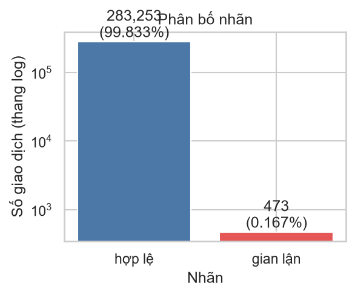

**Phát hiện 2 — `Amount` một mình không phân biệt được, trừ vùng tiền rất nhỏ.** Phân bố số tiền của
hai lớp chồng lấn gần như hoàn toàn. Trung vị của gian lận (9,82 EUR) **thấp hơn** của giao dịch hợp lệ
(22,00 EUR) nhưng trung bình lại **cao hơn** (123,87 so với 88,41): đuôi dày ở cả hai phía. **36% vụ gian
lận có số tiền ≤ 1 EUR** — chi tiết này quay lại ở mục 8.5. Đuôi dày là lý do chuẩn hoá `Amount` bằng
`RobustScaler` (trung vị và IQR) thay vì `StandardScaler`.

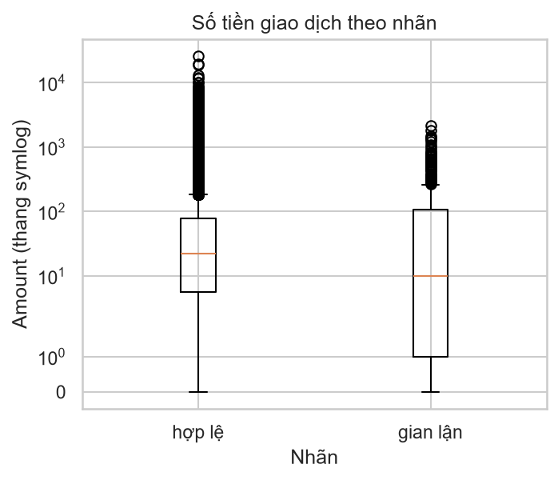

**Phát hiện 3 — gian lận dồn vào giờ vắng.** Lúc 2h tỷ lệ gian lận là 1,451% (48/3.308), lúc 10h
chỉ 0,048% (8/16.548) — chênh 30 lần. Khung 00h–05h chiếm 8,4% lượng giao dịch nhưng 24,3% số vụ gian
lận. Đó là cơ sở thực nghiệm để đưa giờ trong ngày vào mô hình (với giả định ở mục 1.4).

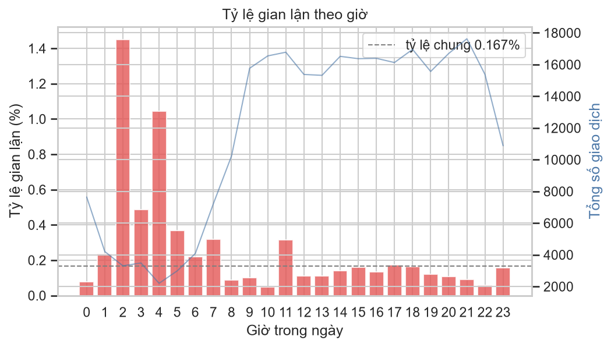

**Phát hiện 4 — V1–V28 trực giao, tương quan với nhãn bị nén.** |r| lớn nhất giữa hai thành phần V chỉ
0,019, nên không cần chạy lại PCA hay lọc đa cộng tuyến. Tương quan điểm–nhị phân với nhãn cao nhất
chỉ −0,313 (V17), dù V17 tách hai lớp rất rõ: với 0,17% lớp dương, độ lớn của tương quan bị tỷ lệ lớp
nén xuống — cùng một cái bẫy như accuracy 99,83%. Chỉ **thứ hạng** của tương quan là đọc được.

**Phát hiện 5 — không đặc trưng đơn nào tách được hai lớp, nhưng bài toán khả thi.** Mọi cặp phân bố
vẫn chồng lấn; lớp gian lận dịch sang phía âm và bè rộng gấp 3–5 lần. Trên hình chiếu t-SNE, 85,8% mẫu
gian lận có đa số láng giềng cùng lớp và tạo thành 2–3 cụm tách hẳn; 4,4% (21 mẫu) nằm lẫn hoàn toàn
giữa giao dịch hợp lệ — đúng nhóm mà mô hình sẽ bỏ lọt (mục 9.2).

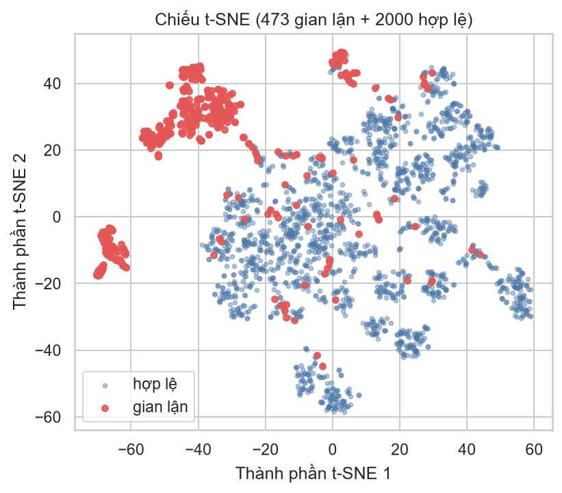

---

## 3. Kiểm định thống kê và xếp hạng đặc trưng

Notebook 02 kiểm định từng đặc trưng trong 30 cột gốc (V1–V28, `Amount`, `Time`):

- **Mann–Whitney U** [7] — không giả định phân phối chuẩn, phù hợp với `Amount` lệch phải và các V
  đuôi dày.
- **Hiệu chỉnh Benjamini–Hochberg** [8] cho 30 kiểm định đồng thời, kiểm soát tỷ lệ phát hiện sai ở 5%.
- **Độ lớn hiệu ứng**: Cohen's d và Cliff's delta [9]. Với 283.000 mẫu, p-value gần như luôn nhỏ;
  độ lớn hiệu ứng mới cho biết khác biệt có đáng kể hay không.

**Kết quả.** 27/30 kiểm định còn ý nghĩa sau hiệu chỉnh BH (Bonferroni chỉ giữ 24). Ba đặc trưng không
có ý nghĩa: V13, V15, V22. 17 đặc trưng có |d| ≥ 0,8 (hiệu ứng lớn).

| Hạng theo d | Đặc trưng | Cohen's d | Cliff's δ | Hạng theo δ | Pearson r |
|---|---|---|---|---|---|
| 1 | V17 | −8,09 | −0,60 | 11 | −0,313 |
| 2 | V14 | −7,52 | −0,89 | 1 | −0,293 |
| 3 | V12 | −6,35 | −0,87 | 3 | −0,251 |
| 4 | V10 | −5,19 | −0,82 | 5 | −0,207 |
| 5 | V16 | −4,67 | −0,68 | 8 | −0,187 |
| 6 | V3 | −4,55 | −0,82 | 6 | −0,182 |

Hai điều đáng giữ:

1. **Cùng một khác biệt, hai thang đo cho hai bức tranh.** V17 có Cohen's d = −8,09 (hiệu ứng khổng lồ)
   nhưng tương quan Pearson chỉ −0,313. Đó không phải mâu thuẫn mà là hệ quả toán học của tỷ lệ lớp
   0,17%.
2. **Cohen's d và Cliff's delta bất đồng về thứ hạng** (Spearman 0,921): V17 hạng 1 theo d nhưng hạng 11
   theo δ. Cohen's d dùng độ lệch chuẩn gộp — bị lớp hợp lệ áp đảo — nên phóng đại đặc trưng mà lớp gian
   lận có phương sai lớn. Câu hỏi "đặc trưng nào thật sự quan trọng" được trả lời lại bằng SHAP ở mục 9.

Phân tích này chỉ phục vụ hiểu dữ liệu, **không** dùng để chọn đặc trưng (mô hình dùng đủ 31 đặc
trưng). Vì thế việc nó được tính trên toàn bộ dữ liệu không gây rò rỉ.

---

## 4. Khung đánh giá

### 4.1 Vì sao PR-AUC, không phải accuracy hay ROC-AUC

- **Accuracy** vô nghĩa: mô hình rỗng đạt 99,83%, và ở mục 5 accuracy còn xếp hạng ngược hai mô hình.
- **ROC-AUC** đo trên trục tỷ lệ dương giả FP / (FP + TN). Với hơn 56.000 giao dịch hợp lệ trong tập
  kiểm thử, mẫu số FP + TN gần như không đổi: hạ ngưỡng từ τ\* xuống mức recall 90% thêm 682 cảnh báo
  giả mà FPR chỉ tăng 1,2 điểm phần trăm, trong khi khối lượng thẩm định tăng 7 lần (mục 8.3). ROC-AUC vì vậy đều cao (0,95–0,98) và che mất
  khác biệt [2].
- **PR-AUC** (average precision) đo trên precision = TP / (TP + FP) — đúng câu hỏi "trong những giao
  dịch bị gắn cờ, bao nhiêu là gian lận thật". Đường cơ sở của nó là tỷ lệ lớp dương (0,00167), nên con
  số có ý nghĩa tuyệt đối: PR-AUC 0,825 nghĩa là gấp khoảng 490 lần đoán ngẫu nhiên.

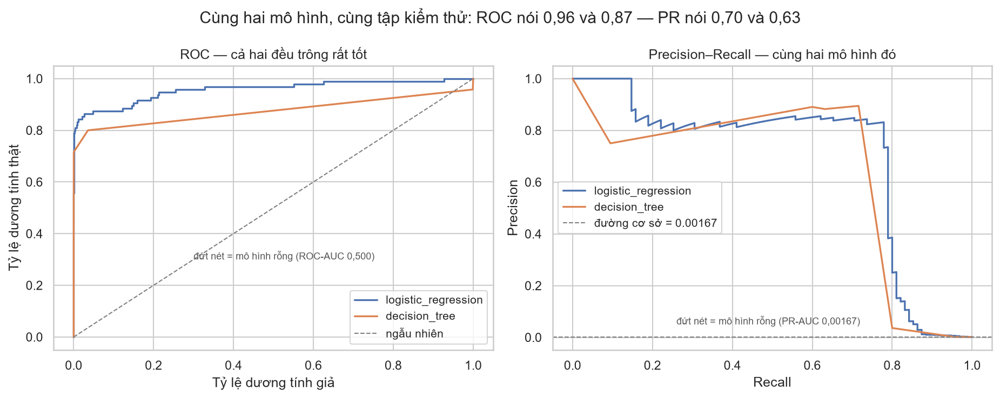

### 4.2 Khoảng tin cậy và quy tắc so sánh

Tập kiểm thử chỉ có **95 vụ gian lận**: mỗi vụ bắt hụt làm recall giảm hơn 1 điểm phần trăm. Vì vậy:

- Mọi chỉ số chính kèm **khoảng tin cậy 95% bằng bootstrap phân tầng** (1.000 lần, lấy mẫu lại riêng
  trong từng lớp để lần lặp nào cũng có đủ 95 mẫu dương) [10].
- So sánh hai mô hình hoặc hai ngưỡng bằng **bootstrap theo cặp**: cùng một mẫu cho cả hai, lấy hiệu.
  So hai khoảng tin cậy riêng lẻ bỏ mất tương quan giữa hai bộ điểm và luôn bảo thủ quá mức.
- **Quy tắc đặt trước:** khoảng tin cậy của hiệu chứa 0 thì **không** tuyên bố bên nào hơn.

### 4.3 Chống rò rỉ dữ liệu

Rò rỉ không làm chương trình lỗi; nó chỉ làm mọi con số đẹp lên một cách vô nghĩa. Bảy điểm kiểm được
viết thành kiểm thử tự động (`tests/test_no_leakage.py`), quét mã trong `src/`, `scripts/` và mọi ô
code của notebook:

| # | Quy tắc | Cách bảo đảm |
|---|---|---|
| 1 | Lấy mẫu lại (SMOTE, undersampling) chỉ nằm **trong** pipeline | `imblearn.pipeline.Pipeline` tự bỏ qua bước lấy mẫu khi dự đoán trên fold kiểm định |
| 2 | Loại trùng lặp trước khi chia tập | Notebook chỉ nạp qua `load_prepared()` |
| 3 | Bộ chuẩn hoá chỉ fit trên dữ liệu huấn luyện của từng fold | `RobustScaler` nằm trong pipeline |
| 4 | Mọi kiểm định chéo phân tầng | `StratifiedKFold`, không `KFold` |
| 5 | Ngưỡng chọn trên **out-of-fold**, không trên tập kiểm thử | Mục 8.2 |
| 6 | Không dòng nào nằm ở cả hai tập | Kiểm thử trực tiếp |
| 7 | Mọi bước ngẫu nhiên dùng chung `random_state = 42` | Kiểm thử quét mã |

Kiểm tra tính hợp lý: PR-AUC cao nhất trong cả đồ án là 0,855, nằm trong dải kỳ vọng 0,80–0,87 của
đặc tả và cách xa ngưỡng báo động 0,95 (gần như chắc chắn có rò rỉ nếu vượt).

---

## 5. Mô hình cơ sở

Ba mô hình, chưa xử lý mất cân bằng, ngưỡng 0,5, trên tập kiểm thử:

| Mô hình | Accuracy | PR-AUC [KTC 95%] | ROC-AUC | Recall | Precision | Bắt được |
|---|---|---|---|---|---|---|
| Mô hình rỗng (luôn "hợp lệ") | 99,8326% | 0,0017 | 0,500 | 0,000 | — | 0/95 |
| Logistic Regression | 99,9154% | 0,696 [0,598; 0,791] | 0,958 | 0,600 | 0,851 | 57/95 |
| Decision Tree (`max_depth = 6`) | 99,9383% | 0,628 [0,522; 0,737] | 0,875 | 0,716 | 0,895 | 68/95 |

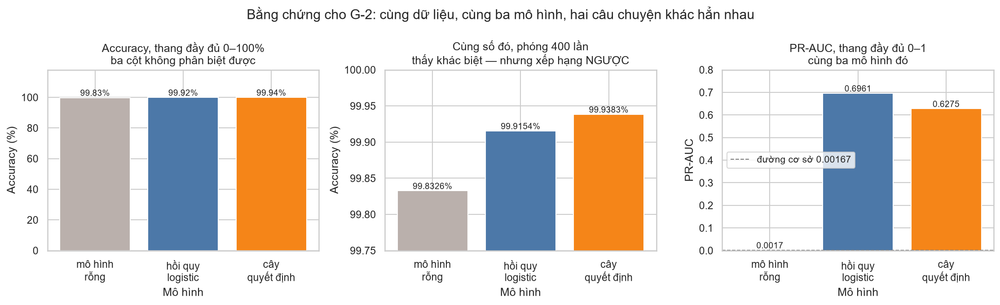

- **Accuracy xếp hạng ngược.** Cây có accuracy cao hơn hồi quy (99,938% so với 99,915%) nhưng PR-AUC
  thấp hơn (0,628 so với 0,696). Ba mô hình chỉ chênh 0,11 điểm phần trăm accuracy, trong khi PR-AUC
  chênh 416 lần giữa mô hình tệ nhất và tốt nhất.
- **Chưa được tuyên bố mô hình nào thắng.** Hiệu PR-AUC hồi quy − cây theo cặp là
  +0,069 [−0,031; +0,158]: khoảng tin cậy chứa 0.
- **Cây chỉ có 8 mức điểm.** Decision Tree sâu 6 tầng chỉ phát ra 8 giá trị điểm khác nhau (hồi quy:
  56.537), nên đường PR của nó là cầu thang 9 bậc và **không thể tối ưu ngưỡng** trên nó. Đây là lý do
  cơ học khiến cây thắng ở τ = 0,5 nhưng thua ở PR-AUC, và là cảnh báo cho mục 6.

---

## 6. So sánh chiến lược xử lý mất cân bằng

Đây là trọng tâm của đề tài: không phải tìm một mô hình thắng, mà hiểu mỗi kỹ thuật xử lý mất cân bằng
đổi được gì và mất gì.

### 6.1 Thiết kế thí nghiệm

**Năm chiến lược** × **bốn mô hình** = 20 tổ hợp:

| Mã | Chiến lược | Cách làm |
|---|---|---|
| S1 | `none` | Không xử lý |
| S2 | `class_weight` | Trọng số lớp: `class_weight="balanced"`; với XGBoost là `scale_pos_weight` = tỷ lệ âm/dương ≈ 599,5 |
| S3 | `undersample` | `RandomUnderSampler`, đưa lớp dương lên 1 : 10 |
| S4 | `smote` | `SMOTE` [3], `k = 5`, sinh mẫu dương tổng hợp tới 1 : 10 |
| S5 | `smote_tomek` | `SMOTETomek`: SMOTE rồi xoá các cặp Tomek [4] |

Mô hình: Logistic Regression, Decision Tree (`max_depth = 6`), Random Forest (300 cây), XGBoost
(500 cây, `max_depth = 6`, `learning_rate = 0,05`) [5].

Ba quyết định thiết kế:

- **Lấy mẫu lại chỉ tới 1 : 10, không 1 : 1.** Cân bằng hoàn toàn làm méo xác suất tiên nghiệm rất
  mạnh: mô hình trả điểm lệch cao và precision sụp.
- **Mọi bước nằm trong một pipeline của imbalanced-learn** [6] (`RobustScaler` → lấy mẫu lại → bộ phân
  loại), đánh giá bằng kiểm định chéo phân tầng 5 fold **trên tập huấn luyện**. Lấy mẫu lại ngoài
  pipeline là lỗi rò rỉ phổ biến nhất ở bài toán này: mẫu SMOTE nội suy từ mẫu kiểm định lọt vào tập
  huấn luyện, và mọi chỉ số vọt lên khoảng 0,99.
- **Một lượt huấn luyện mỗi tổ hợp.** `cross_val_predict` cho điểm out-of-fold của cả 226.980 giao
  dịch; từ đó tính PR-AUC từng fold (lấy trung bình và độ lệch chuẩn), chọn ngưỡng theo chi phí và đo
  recall/precision tại ngưỡng đó. Cả lưới chạy 45,7 phút, có điểm lưu để chạy nối tiếp.

### 6.2 Bảng kết quả 20 tổ hợp

Sắp theo PR-AUC giảm dần. τ\* là ngưỡng cực tiểu chi phí (FN 122,21 EUR, FP 5 EUR — mục 8.1) chọn trên
điểm out-of-fold của chính tổ hợp đó; recall và precision đo tại τ\*. "Mức điểm" là số giá trị điểm rủi
ro khác nhau trên 226.980 giao dịch.

| # | Mô hình | Chiến lược | PR-AUC (TB ± ĐLC) | ROC-AUC | τ\* | Recall | Precision | Cảnh báo/ngày | Mức điểm | Giây |
|---|---|---|---|---|---|---|---|---|---|---|
| 1 | XGBoost | class_weight | **0,8549 ± 0,0301** | 0,982 | 0,023 | 0,852 | 0,702 | 287 | 221.674 | 36 |
| 2 | Random Forest | smote | 0,8549 ± 0,0311 | 0,976 | 0,190 | 0,855 | 0,666 | 303 | 219 | 368 |
| 3 | Random Forest | smote_tomek | 0,8549 ± 0,0311 | 0,976 | 0,190 | 0,855 | 0,666 | 303 | 219 | 652 |
| 4 | XGBoost | smote | 0,8529 ± 0,0297 | 0,980 | 0,034 | 0,852 | 0,638 | 316 | 222.236 | 45 |
| 5 | XGBoost | smote_tomek | 0,8529 ± 0,0297 | 0,980 | 0,034 | 0,852 | 0,638 | 316 | 222.236 | 326 |
| 6 | XGBoost | none | 0,8514 ± 0,0302 | 0,983 | 0,047 | 0,841 | **0,867** | 229 | 221.544 | 33 |
| 7 | Random Forest | none | 0,8406 ± 0,0333 | 0,953 | 0,077 | 0,852 | 0,687 | 293 | 207 | 398 |
| 8 | Random Forest | class_weight | 0,8404 ± 0,0285 | 0,970 | 0,123 | 0,852 | 0,711 | 283 | 200 | 159 |
| 9 | XGBoost | undersample | 0,7811 ± 0,0691 | 0,982 | 0,868 | 0,836 | 0,689 | 287 | 221.912 | 5 |
| 10 | Random Forest | undersample | 0,7586 ± 0,0446 | 0,976 | 0,586 | 0,852 | 0,697 | 289 | 269 | 6 |
| 11 | Logistic Regression | none | 0,7578 ± 0,0305 | 0,977 | 0,017 | 0,855 | 0,541 | 373 | 226.318 | 15 |
| 12 | Logistic Regression | smote | 0,7572 ± 0,0235 | 0,978 | 0,614 | 0,860 | 0,544 | 373 | 226.308 | 13 |
| 13 | Logistic Regression | smote_tomek | 0,7572 ± 0,0235 | 0,978 | 0,614 | 0,860 | 0,544 | 373 | 226.308 | 291 |
| 14 | Logistic Regression | class_weight | 0,7416 ± 0,0294 | 0,980 | 0,972 | 0,857 | 0,505 | 401 | 226.109 | 22 |
| 15 | Logistic Regression | undersample | 0,7185 ± 0,0206 | 0,983 | 0,617 | 0,857 | 0,415 | 488 | 226.280 | 1 |
| 16 | Decision Tree | none | 0,6948 ± 0,0374 | 0,871 | 0,500 | 0,780 | 0,886 | 208 | 30 | 24 |
| 17 | Decision Tree | smote | 0,6404 ± 0,0395 | 0,936 | 0,803 | 0,818 | 0,670 | 288 | 97 | 29 |
| 18 | Decision Tree | smote_tomek | 0,6404 ± 0,0395 | 0,936 | 0,803 | 0,818 | 0,670 | 288 | 97 | 276 |
| 19 | Decision Tree | class_weight | 0,3586 ± 0,1167 | 0,878 | 0,994 | 0,796 | 0,368 | 511 | 55 | 26 |
| 20 | Decision Tree | undersample | 0,2405 ± 0,0529 | 0,918 | 0,750 | 0,839 | 0,264 | 749 | 23 | 1 |

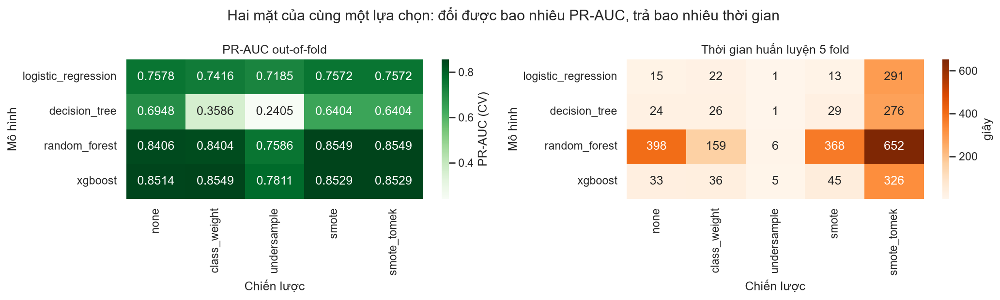

Hai điều đọc được ngay: ROC-AUC của 20 tổ hợp nằm gọn trong 0,87–0,98 trong khi PR-AUC trải từ 0,24
tới 0,85 (mục 4.1); và **mô hình quyết định nhiều hơn chiến lược** — hàng của XGBoost và Random Forest
đều xanh đậm, hàng của Decision Tree nhạt bất kể chiến lược.

### 6.3 Phát hiện 1 — nhóm dẫn đầu hoà nhau, không được xếp hạng

Sáu dòng đầu bảng nằm trong dải 0,8514–0,8549, rộng 0,0035 — chưa tới một phần tám độ lệch chuẩn giữa
các fold (0,030). Bootstrap hiệu PR-AUC theo cặp trên điểm out-of-fold cho thấy 3 trong 4 cặp so sánh
có khoảng tin cậy chứa 0. Khác biệt thật duy nhất trong nhóm cao: XGBoost + class_weight hơn
Random Forest + class_weight **+0,0152 [+0,0056; +0,0270]**. Báo cáo vì vậy nói "một nhóm dẫn đầu",
không nói "tổ hợp X thắng".

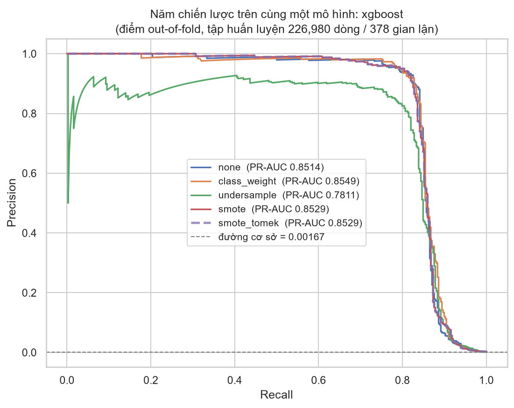

### 6.4 Phát hiện 2 — `class_weight` hay SMOTE: câu trả lời phụ thuộc mô hình

Đặc tả dự báo rằng với mô hình cây, trọng số lớp ngang hoặc nhỉnh hơn SMOTE mà rẻ hơn nhiều. Thực tế:

| Mô hình | class_weight | SMOTE | Chênh | Giây cw | Giây SMOTE | SMOTE đắt hơn |
|---|---|---|---|---|---|---|
| XGBoost | **0,8549** | 0,8529 | +0,0020 | 36,1 | 44,7 | 1,24× |
| Random Forest | 0,8404 | **0,8549** | −0,0145 | 158,7 | 368,1 | 2,32× |
| Logistic Regression | 0,7416 | **0,7572** | −0,0156 | 21,8 | 13,3 | 0,61× |
| Decision Tree | 0,3586 | **0,6404** | −0,2818 | 25,8 | 28,6 | 1,11× |

- **Đúng với XGBoost:** hai chiến lược hoà (khoảng tin cậy chứa 0), `scale_pos_weight` rẻ hơn 1,24 lần.
  Đây là mô hình được chọn, nên dự báo đúng ở chỗ quan trọng nhất.
- **Sai với Random Forest:** SMOTE hơn thật, +0,0146 [+0,0076; +0,0220], đổi lại đắt gấp 2,3 lần.
- **Sai với Logistic Regression:** SMOTE vừa hơn vừa rẻ hơn.
- **Sai hẳn với Decision Tree:** `class_weight="balanced"` làm PR-AUC **sụp từ 0,695 xuống 0,359**, tệ
  hơn không xử lý gì. Trọng số lớp khoảng 600 kéo các nhánh của cây nông về phía tách lớp dương quá sớm,
  và với 55 mức điểm thì không còn gì để xếp hạng.

Lấy trung bình gộp cả bốn mô hình (−0,0775) là sai cách trình bày: con số bị Decision Tree kéo lệch.
Không tính Decision Tree thì trung bình chỉ còn −0,0094.

### 6.5 Phát hiện 3 — SMOTE + Tomek giống SMOTE tới từng bit, mà tốn 40% thời gian lưới

Không chỉ PR-AUC bằng nhau tới bốn chữ số: **mảng điểm out-of-fold của S5 giống hệt S4 tới từng phần
tử** ở cả bốn mô hình. Bước Tomek không xoá một dòng nào, nhưng tốn **1.089 giây = 18,2 phút**, tức 40%
của cả lưới 45,7 phút.

Vì sao? Kiểm lại trên fold 1: dữ liệu gốc **có** cặp Tomek — trước SMOTE, `TomekLinks` tìm được 21 cặp
(xoá 42 dòng, trong đó 21 vụ gian lận); sau SMOTE còn 0. Chính SMOTE xoá chúng: mỗi vụ gian lận thật
được dùng làm gốc để sinh khoảng 59 điểm tổng hợp trên các đoạn nối nó với láng giềng cùng lớp, nên
láng giềng gần nhất của nó trở thành một điểm gian lận tổng hợp — không còn cặp khác lớp nào là láng
giềng gần nhất *của nhau*. `SMOTETomek` chạy SMOTE trước, Tomek sau, nên ở tỷ lệ này bước Tomek luôn
vô tác dụng. Kết quả âm tính này được giữ trong bảng vì tự nó là một phát hiện; các lần chạy lại về sau
nên bỏ S5.

### 6.6 Phát hiện 4 — độ mịn của điểm rủi ro loại Random Forest

Random Forest hoà PR-AUC với XGBoost nhưng chỉ phát ra **200–269 mức điểm** trên 226.980 giao dịch
(300 cây cho tối đa 301 giá trị `k/300`); XGBoost có khoảng 222.000 mức, gấp hơn 1.000 lần. Decision
Tree chỉ có 23–97 mức. Toàn bộ mục 8 dựa trên việc kéo ngưỡng; với 200 bậc thang, một thay đổi nhỏ của
ngưỡng hoặc không đổi gì, hoặc nhảy hàng chục cảnh báo một lúc.

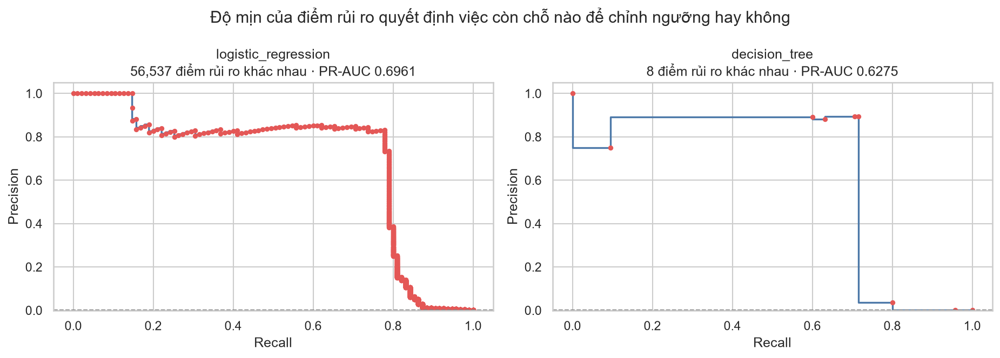

### 6.7 Phát hiện 5 — undersampling nhanh nhất nhưng kém nhất và bất ổn nhất

Đưa lớp dương lên 1 : 10 bằng cách bỏ khoảng 98% giao dịch hợp lệ làm mọi mô hình huấn luyện trong
1–6 giây, nhưng PR-AUC giảm ở cả
bốn mô hình, và độ lệch chuẩn giữa các fold của XGBoost tăng gấp đôi (0,069 so với 0,030): mô hình
thấy quá ít ví dụ về giao dịch hợp lệ "khó". Recall tại τ\* vẫn cao (0,84–0,86) nhưng precision thấp
nhất ở Logistic Regression (0,415) và Decision Tree (0,264).

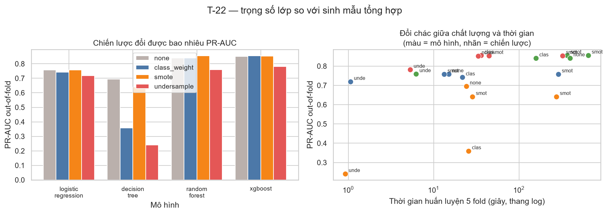

### 6.8 Lựa chọn cho các bước sau

**XGBoost + `class_weight` (`scale_pos_weight` ≈ 599,5).** Ba lý do, theo thứ tự quan trọng:

1. **Nằm trong nhóm PR-AUC cao nhất** (0,8549); không cấu hình nào chứng minh được là hơn nó.
2. **Nhanh hơn 10,2 lần** Random Forest + SMOTE cùng điểm số (36 giây so với 368 giây) — quan trọng vì
   bước sau tìm kiếm siêu tham số trên chính cấu hình này.
3. **Hơn 1.000 lần số mức điểm** so với Random Forest, tức còn chỗ thật để chọn ngưỡng.

---

## 7. Mô hình cuối, tinh chỉnh và khoảng tin cậy

### 7.1 Tinh chỉnh siêu tham số — một kết quả âm tính

`RandomizedSearchCV`, 30 lần thử × 5 fold, `scoring = "average_precision"`, trên pipeline đã chọn;
không gian tìm gồm `n_estimators` 200–800, `max_depth` 3–8, `learning_rate` 0,01–0,3 (thang log),
`subsample`, `colsample_bytree` 0,6–1, `min_child_weight` 1–10 và `scale_pos_weight` ∈ {1, 10, 100, 599,5}.
Chạy 19,8 phút.

| Hạng | PR-AUC CV | ĐLC | PR-AUC train | n_estimators | max_depth | learning_rate | scale_pos_weight |
|---|---|---|---|---|---|---|---|
| 1 | 0,8538 | 0,0328 | 1,0000 | 750 | 6 | 0,090 | 10 |
| 2 | 0,8536 | 0,0319 | 1,0000 | 761 | 5 | 0,054 | 599,5 |
| 3 | 0,8532 | 0,0322 | 1,0000 | 602 | 7 | 0,056 | 10 |
| 4 | 0,8531 | 0,0311 | 1,0000 | 330 | 7 | 0,048 | 10 |
| 5 | 0,8530 | 0,0289 | 0,9998 | 676 | 6 | 0,020 | 100 |

- Cấu hình đầu bảng (0,8538) **thấp hơn** cấu hình mặc định của mục 6 (0,8549). Năm cấu hình đầu cách
  nhau 0,0008 trong khi độ lệch chuẩn giữa các fold là 0,03: bề mặt mục tiêu phẳng.
- `scale_pos_weight` gần như không ảnh hưởng PR-AUC: nó dịch điểm rủi ro chứ không đổi thứ tự.
- PR-AUC trên tập huấn luyện bằng 1,0 ở mọi cấu hình tốt — mô hình khớp hoàn toàn tập huấn luyện;
  khoảng cách 0,15 với điểm kiểm định là bình thường với boosting nhiều cây và không làm giảm điểm
  kiểm định.

**Quy tắc đặt trước:** cấu hình tinh chỉnh chỉ thay cấu hình mặc định nếu bootstrap hiệu PR-AUC theo
cặp trên điểm out-of-fold không chứa 0. Kết quả **−0,0006 [−0,0087; +0,0072]** → **giữ cấu hình mặc
định**. Lựa chọn được chốt trên tập huấn luyện, trước khi nhìn tập kiểm thử.

### 7.2 Kết quả trên tập kiểm thử

Huấn luyện lại trên toàn bộ tập huấn luyện, đo **một lần** trên 56.746 giao dịch (95 gian lận) tại
τ\* = 0,0232 chọn trên out-of-fold:

| Chỉ số | Giá trị [KTC 95%] | Tiêu chí nghiệm thu |
|---|---|---|
| PR-AUC | **0,825** [0,747; 0,896] | AC-M1: ≥ 0,75 — đạt |
| ROC-AUC | 0,977 [0,961; 0,991] | |
| Recall tại τ\* | **0,811** [0,737; 0,884] — bắt 77/95 vụ | AC-M2: ≥ 0,75 — đạt |
| Precision tại τ\* | 0,670 [0,600; 0,752] — 38 cảnh báo giả | |
| F1 tại τ\* | 0,733 | |
| Đường cơ sở PR-AUC | 0,00167 | |

**Cần nói rõ:** cận dưới của PR-AUC (0,747) và của recall (0,737) đều **sát dưới 0,75**. Hai tiêu chí
đạt theo ước lượng điểm, không đạt "chắc chắn" theo khoảng tin cậy — hệ quả trực tiếp của việc chỉ có
95 mẫu dương.

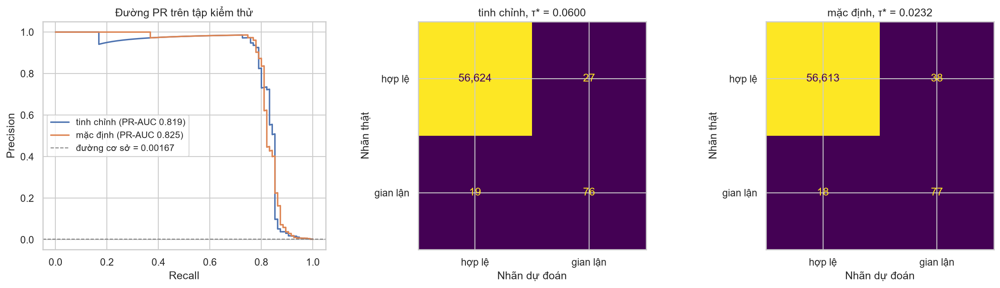

### 7.3 Chia theo thời gian — ước lượng sát với triển khai hơn

Chia ngẫu nhiên trộn giao dịch của cả hai ngày vào cả hai tập. Triển khai thật thì mô hình học từ quá
khứ và chấm tương lai. Bảng đối chiếu (AC-M7), ngưỡng của từng cách chia chọn trên out-of-fold của
chính tập huấn luyện đó:

| Cách chia | Train (gian lận) | Test (gian lận) | PR-AUC test [KTC] | Recall | Precision | FP |
|---|---|---|---|---|---|---|
| Ngẫu nhiên 80/20 | 226.980 (378) | 56.746 (95) | 0,825 [0,747; 0,896] | 0,811 | 0,670 | 38 |
| Ngẫu nhiên, train thu nhỏ bằng ngày 1 (đối chứng) | 144.236 (240) | 56.746 (95) | 0,825 [0,749; 0,896] | 0,800 | 0,826 | 16 |
| **Ngày 1 → ngày 2** | 144.236 (272) | 139.490 (201) | **0,782** [0,728; 0,836] | 0,836 | **0,332** | **338** |

Dòng đối chứng tách được hai nguyên nhân: bớt dữ liệu huấn luyện xuống bằng cỡ ngày 1 chỉ làm PR-AUC
giảm 0,0004; phần còn lại, **−0,043, là do thời gian**. Khoảng tin cậy PR-AUC của hai cách chia chồng
lấn nhau, nhưng tại ngưỡng cố định thì khác biệt rõ: ngày 2 sinh cảnh báo giả gấp nhiều lần, precision
giảm còn 0,33. Tỷ lệ gian lận cũng đổi từ 0,189% (ngày 1) xuống 0,144% (ngày 2). Kết luận cho triển
khai: **ngưỡng phải được hiệu chỉnh lại định kỳ**, không đặt một lần rồi để đó.

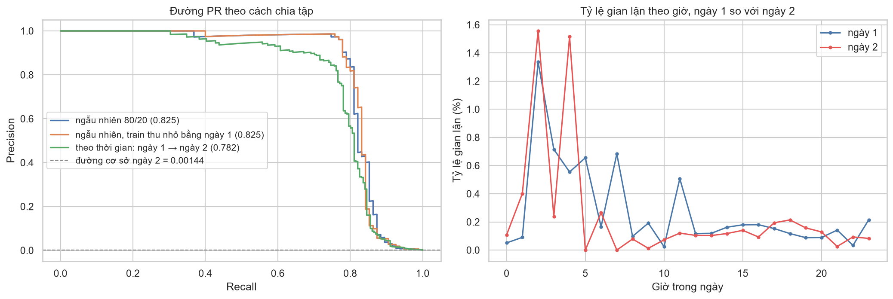

### 7.4 Đối chứng không giám sát: autoencoder

Một autoencoder (mạng `MLPRegressor` của scikit-learn — môi trường không có PyTorch) chỉ học tái tạo
giao dịch hợp lệ; sai số tái tạo dùng làm điểm bất thường.

| Mô hình | PR-AUC | ROC-AUC |
|---|---|---|
| Autoencoder (không dùng nhãn) | 0,329 | 0,949 |
| XGBoost + class_weight | **0,825** | 0,977 |

Hiệu PR-AUC +0,496 [+0,394; +0,583], XGBoost thắng ở 100% số lần lặp. Autoencoder **có** nhận ra gian
lận là bất thường — 93/95 vụ có sai số tái tạo trên trung vị, sai số của V17 ở lớp gian lận gấp gần
1.300 lần lớp hợp lệ — nhưng không phân biệt được giao dịch hợp lệ hiếm gặp với gian lận: trong 1%
giao dịch "bất thường" nhất (568 giao dịch) chỉ 74 là gian lận. Nó thua vì bỏ qua 378 nhãn có sẵn — bài
toán có nhãn thì học có giám sát thắng.

### 7.5 Tái lập

Chạy lại 9 notebook 01 → 08, mỗi notebook một kernel mới, tổng 71 phút: PR-AUC trước và sau
**0,8252465892 → 0,8252465892, lệch 0** (dung sai 0,001, AC-M5); 12 con số chính, τ\*, mọi bảng
`reports/*.csv` và mọi hình trùng hoàn toàn. Ba giới hạn: lượt kiểm không chạy lại lưới 20 tổ hợp và
tìm kiếm siêu tham số (notebook đọc điểm lưu); mới kiểm trên một máy 12 lõi — XGBoost `hist` cho điểm
lệch nhẹ theo số luồng **khi huấn luyện**; và trong container Linux, điểm chấm lệch 1 ulp float32 ở
35/56.746 giao dịch so với Windows, không quyết định nào bị lật.

---

## 8. Ngưỡng quyết định, đánh đổi Precision–Recall và chi phí

Mô hình trả về một điểm; biến điểm đó thành quyết định là một lựa chọn riêng, quyết định trực tiếp số
tiền mất và khối lượng việc của đội thẩm định.

### 8.1 Vì sao không dùng 0,5, và mô hình chi phí

Ngưỡng 0,5 ngầm giả định hai loại lỗi tốn như nhau và hai lớp cân bằng — ở bài toán này cả hai đều sai.
Hàm chi phí kỳ vọng (theo Elkan [11]):

  **Chi phí(τ) = c_FN × FN(τ) + c_FP × FP(τ)**

với hai giả định nghiệp vụ, người dùng đổi được lúc chạy:

| Mã | Giả định | Giá trị | Nguồn |
|---|---|---|---|
| A-01 | Bỏ lọt một vụ gian lận mất khoảng số tiền trung bình của một vụ | c_FN = 122,21 EUR | Trung bình `Amount` của gian lận trên dữ liệu **thô** |
| A-02 | Thẩm định một cảnh báo tốn | c_FP = 5 EUR | Giả định |

Tỷ lệ c_FN : c_FP ≈ 24,4 : 1. Mục 8.4 kiểm độ nhạy theo tỷ lệ này; mục 8.5 kiểm chính dạng của hàm
chi phí.

Số cảnh báo quy về **cảnh báo mỗi ngày trên toàn luồng giao dịch** — con số mà người quản lý vận hành
quan tâm: tập kiểm thử là 20% của hai ngày, nên nhân 2,5.

### 8.2 Chọn ngưỡng trên out-of-fold

Ngưỡng là một phép **chọn**, nên không được làm trên tập kiểm thử: chọn rồi đo trên cùng tập làm mọi
con số lạc quan hơn thực tế. Ngưỡng chọn trên **điểm out-of-fold** của 226.980 giao dịch huấn luyện
(378 gian lận); tập kiểm thử chỉ đo kết quả tại ngưỡng đã chốt.

Ngưỡng ứng viên là **mọi điểm out-of-fold khác nhau** (khoảng 222.000), không phải lưới 200 điểm của
thiết kế ban đầu. Với τ\* hai cách gần trùng (0,02317 so với 0,02321), nhưng lưới thô làm hỏng tiêu chí
ngân sách: nó chỉ tìm được 172,5 trong 200 cảnh báo/ngày cho phép và mất 8 điểm recall.

**Kết quả: τ\* = 0,02317.** Trên out-of-fold, chi phí cực tiểu 7.407 EUR; tại 0,5 là 8.114 EUR (+9,5%);
không chặn gì là 46.195 EUR. **Đáy chi phí phẳng:** mọi τ trong [0,013; 0,140] đều nằm trong 5% của
cực tiểu.

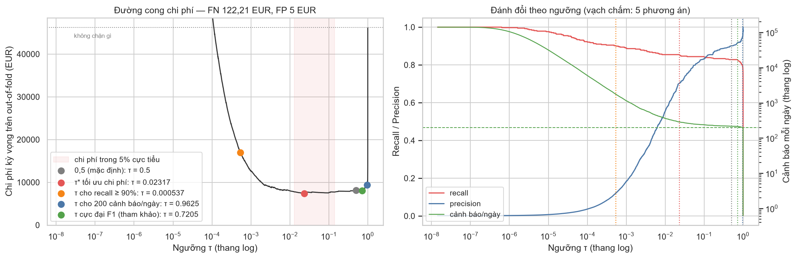

### 8.3 Bảng so sánh các phương án ngưỡng

Mỗi ngưỡng chọn trên out-of-fold theo một tiêu chí, đo trên tập kiểm thử (56.746 giao dịch, 95 gian lận):

| Ngưỡng | τ | Cảnh báo/ngày | TP | FP | FN | Precision [KTC] | Recall [KTC] | Chi phí |
|---|---|---|---|---|---|---|---|---|
| Mặc định 0,5 | 0,5 | 195 | 74 | 4 | 21 | 0,949 [0,899; 0,987] | 0,779 [0,695; 0,863] | 2.586 EUR |
| **τ\* — cực tiểu chi phí** | **0,0232** | **287** | **77** | **38** | **18** | **0,670 [0,600; 0,752]** | **0,811 [0,737; 0,884]** | **2.390 EUR** |
| Recall ≥ 90% trên OOF | 0,00054 | 2.007 | 83 | 720 | 12 | 0,103 [0,094; 0,114] | 0,874 [0,811; 0,937] | 5.067 EUR |
| Ngân sách 200 cảnh báo/ngày | 0,9625 | 175 | 69 | 1 | 26 | 0,986 [0,956; 1,000] | 0,726 [0,642; 0,811] | 3.182 EUR |
| Cực đại F1 (tham khảo) | 0,7205 | 190 | 73 | 3 | 22 | 0,961 [0,915; 1,000] | 0,768 [0,684; 0,853] | 2.704 EUR |

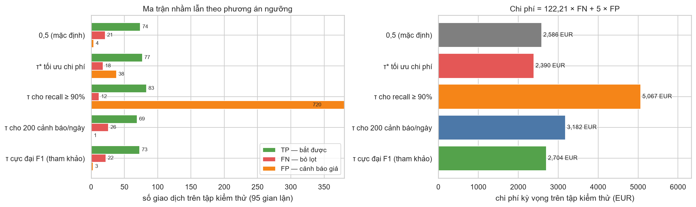

**Diễn giải bằng lời:** *hạ ngưỡng từ 0,5 xuống τ\* = 0,0232 bắt thêm **3** vụ gian lận, đổi lại **34**
cảnh báo giả, tiết kiệm ròng **197 EUR** trên tập kiểm thử (khoảng 490 EUR/ngày trên toàn luồng) —
dưới giả định chi phí cố định của mục 8.1.* Bootstrap theo cặp cho khoản tiết kiệm trên tập kiểm thử là
−197 [−676; +160] EUR — **chứa 0**. Trên out-of-fold (378 gian lận) là −707 [−1.513; −24] EUR — không
chứa 0. Vì vậy kết luận "τ\* rẻ hơn 0,5" dựa trên out-of-fold, và chỉ đứng dưới giả định chi phí cố
định (mục 8.5).

Ba điều khác đọc từ bảng:

- **Ngưỡng 0,5 không tệ như lý thuyết dự báo.** `scale_pos_weight` đã đẩy điểm lớp dương lên sát 1,
  nên tại 0,5 recall vẫn 0,779. Chọn ngưỡng tiết kiệm khoảng 9% chi phí, không phải hàng chục phần trăm.
- **Ràng buộc chọn vừa khít trên OOF thì hụt trên dữ liệu mới.** Ngưỡng cho recall ≥ 90% trên
  out-of-fold (0,902) chỉ cho 0,874 trên tập kiểm thử, và đổi lấy 2.007 cảnh báo/ngày — gấp 10 lần năng
  lực thẩm định giả định. Ràng buộc vận hành nên đặt có biên an toàn.
- **τ\* vượt ngân sách thẩm định:** 287 cảnh báo/ngày so với 200. Nếu năng lực thẩm định là ràng buộc
  cứng, ngưỡng hợp lý là 0,9625 — mất 8 vụ gian lận so với τ\*, chi phí tăng 33%. Đó là quyết định của
  người vận hành; hệ thống cho thấy cái giá của nó (mục 10).

### 8.4 Độ nhạy theo tỷ lệ chi phí

c_FN và c_FP đều là giả định, nên khuyến nghị chỉ vững nếu ngưỡng tối ưu ổn định trong một dải tỷ lệ rộng
(AC-M8). Giữ c_FP = 5 EUR, đổi c_FN:

| FN : FP | c_FN (EUR) | τ tối ưu (OOF) | Recall test | Precision test | Cảnh báo/ngày (test) | Hối tiếc khi vẫn dùng τ\* mặc định |
|---|---|---|---|---|---|---|
| 5 : 1 | 25 | 0,7205 | 0,768 | 0,961 | 190 | 16,7% |
| 7,5 : 1 | 37,5 | 0,0986 | 0,800 | 0,844 | 225 | 8,5% |
| 10 : 1 | 50 | 0,0986 | 0,800 | 0,844 | 225 | 5,0% |
| 15 : 1 | 75 | 0,0986 | 0,800 | 0,844 | 225 | 1,4% |
| 20 : 1 – 50 : 1 | 100 – 250 | **0,0232** | 0,811 | 0,670 | 287 | 0% |
| 75 : 1 | 375 | 0,0023 | 0,853 | 0,263 | 770 | 4,4% |
| 100 : 1 | 500 | 0,0023 | 0,853 | 0,263 | 770 | 8,8% |

"Hối tiếc" là phần chi phí vượt cực tiểu (trên out-of-fold) nếu vẫn giữ τ\* = 0,0232 khi tỷ lệ thật là
giá trị ở cột đầu.

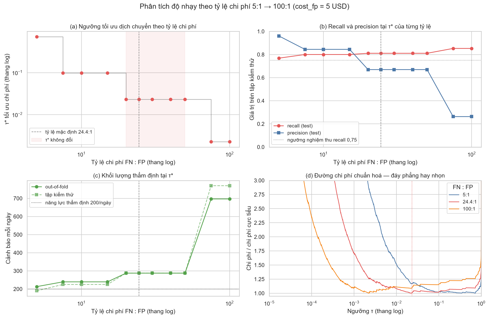

- **τ\* đổi theo bậc, không liên tục**, và **không đổi trên cả dải 20 : 1 → 50 : 1** bao quanh tỷ lệ mặc
  định 24,4 : 1.
- **Dùng τ\* mặc định khi tỷ lệ thật khác**, mức hối tiếc ≤ 5% trong dải 10 : 1 → 75 : 1.
- **Recall trên tập kiểm thử luôn nằm trong 0,77–0,85.** Tỷ lệ chi phí thật sự quyết định **khối lượng
  thẩm định** (190 → 770 cảnh báo/ngày), không quyết định recall: các vụ bị bỏ lọt nằm ở điểm rất thấp
  (mục 9.2), hạ ngưỡng thêm chỉ đổi lấy hàng trăm cảnh báo giả.

### 8.5 Kiểm tra giả định chi phí: tính theo số tiền của từng vụ

Mục 8.1 tính **mọi** vụ bỏ lọt bằng cùng 122,21 EUR, trong khi 36% vụ gian lận có số tiền ≤ 1 EUR (mục 2).
Hai câu hỏi:

**(a) Nguồn của 122,21 có làm lệch τ\* không?** Con số này là trung bình trên dữ liệu thô — gồm cả tập
kiểm thử và dòng trùng. Đúng quy tắc thì nên ước lượng trên tập huấn luyện:

| Nguồn của c_FN | Giá trị | τ\* trên out-of-fold |
|---|---|---|
| Dữ liệu thô (đang dùng) | 122,21 EUR | 0,023173 |
| Sau khi loại trùng lặp | 123,87 EUR | 0,023173 |
| Chỉ tập huấn luyện | 115,94 EUR | 0,023173 |

τ\* không đổi — đáy đủ phẳng để sai lệch này không ảnh hưởng kết luận.

**(b) Nếu chi phí bỏ lọt là số tiền của chính vụ bị lọt** (c_FP vẫn 5 EUR):

| Tập | Ngưỡng | TP | FP | FN | Tiền gian lận bị lọt | Chi phí — cố định | Chi phí — theo số tiền |
|---|---|---|---|---|---|---|---|
| Out-of-fold | 0,5 | 313 | 34 | 65 | 10.735 EUR | 8.114 | 10.905 |
| Out-of-fold | τ\* = 0,0232 | 323 | 137 | 55 | 10.430 EUR | **7.407** | 11.115 |
| Out-of-fold | τ\*ₐ = 0,0066 | 326 | 350 | 52 | 9.123 EUR | 8.105 | **10.873** |
| Kiểm thử | 0,5 | 74 | 4 | 21 | 3.793 EUR | 2.586 | 3.813 |
| Kiểm thử | τ\* = 0,0232 | 77 | 38 | 18 | 3.783 EUR | **2.390** | 3.973 |
| Kiểm thử | τ\*ₐ = 0,0066 | 78 | 89 | 17 | 3.332 EUR | 2.523 | **3.777** |

τ\*ₐ là ngưỡng cực tiểu chi phí theo số tiền, chọn trên out-of-fold. Hiệu chi phí theo cặp (A − B, âm
nghĩa là A rẻ hơn):

| So sánh | Tập | Chi phí cố định | Chi phí theo số tiền |
|---|---|---|---|
| τ\* so với 0,5 | Out-of-fold | −707 [−1.513; −24] | +209 [−320; +539] |
| τ\* so với 0,5 | **Kiểm thử** | −197 [−676; +160] | **+160 [+103; +217]** |
| τ\*ₐ so với 0,5 | Kiểm thử | −64 [−603; +333] | −36 [−983; +486] |
| τ\*ₐ so với τ\* | Kiểm thử | +133 [−157; +315] | −196 [−1.144; +315] |

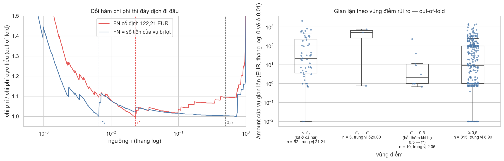

**Khi tính theo số tiền, τ\* đắt hơn 0,5 trên tập kiểm thử, và khoảng tin cậy không chứa 0** (τ\* đắt
hơn ở 100% lần lặp bootstrap). Lý do nằm ở hình bên phải: những vụ mà việc hạ ngưỡng 0,5 → τ\* "bắt
thêm" là **vụ nhỏ** — trung vị 2,06 EUR trên out-of-fold; trên tập kiểm thử là ba vụ 2,22 / 3,76 /
3,79 EUR — đổi lấy 34 × 5 = 170 EUR thẩm định. Ngược lại, tiền mất tập trung ở vài vụ lớn mà ngưỡng hợp
lý nào cũng bỏ lọt: ở τ\*, ba vụ lớn nhất (549, 723, 1.097 EUR) chiếm 63% trong 3.783 EUR bị lọt trên
tập kiểm thử, còn 8/18 vụ lọt có số tiền ≤ 1 EUR. Đường chi phí theo số tiền phẳng và lởm chởm trên cả
dải 0,007 … 0,7 (hình trái), và τ\*ₐ không hơn 0,5 hay τ\* một cách có ý nghĩa thống kê.

**Hệ quả cho kết luận.** Câu "hạ ngưỡng từ 0,5 xuống τ\* tiết kiệm tiền" chỉ đúng dưới giả định mỗi vụ
lọt tốn 122,21 EUR. Điều vững dưới cả hai cách tính là: (1) đáy chi phí phẳng trên một dải ngưỡng rộng;
(2) trong dải đó, chọn ngưỡng theo **năng lực thẩm định** và theo giả định chi phí mà nghiệp vụ xác
nhận; (3) giả định chi phí phải được nêu rõ, vì nó quyết định cả **dấu** của khoản tiết kiệm. Hệ thống
vẫn dùng τ\* = 0,02317 làm mặc định — đổi hay không là quyết định nghiệp vụ, không phải kết luận thống kê.

### 8.6 Từ điểm tới hành động: cho qua, thẩm định, đề xuất chặn

Hệ thống phân ba mức quyết định. Ngưỡng τ tách "cho qua" với "cần thẩm định"; một ngưỡng thứ hai tách
"cần thẩm định" với "đề xuất chặn". Thiết kế ban đầu đặt ngưỡng chặn ở 3τ — một bội số không dựa trên
phân tích nào. Đo trên dữ liệu thì sai hẳn, nên ngưỡng chặn được chọn lại theo **precision**: ngưỡng nhỏ
nhất mà *mọi* ngưỡng từ đó trở lên có precision ≥ p trên out-of-fold (precision không đơn điệu theo
ngưỡng, nên điều kiện đặt cho cả phần đuôi):

| Luật chặn | Ngưỡng chặn | Tập | Thẩm định: gian lận / hợp lệ | Chặn: gian lận / hợp lệ | Precision của "chặn" |
|---|---|---|---|---|---|
| Cũ: 3τ\* | 0,0695 | Kiểm thử | **0** / 19 | 77 / **19** | 0,802 |
| Precision ≥ 90% (OOF) | 0,5568 | Kiểm thử | 3 / 35 | 74 / 3 | 0,961 |
| **Precision ≥ 95% (OOF)** | **0,9735** | Kiểm thử | **8** / 37 | **69 / 1** | **0,986** |
| Precision ≥ 97% (OOF) | 0,9908 | Kiểm thử | 9 / 37 | 68 / 1 | 0,986 |

Luật 3τ để dải thẩm định **không có vụ gian lận nào** và chặn tự động một nửa số cảnh báo giả. Hệ thống
dùng mức 95%: chặn tự động 69 vụ gian lận và đúng 1 khách hợp lệ; dải thẩm định có 8 vụ gian lận — đúng
loại việc cần con người.

### 8.7 Điểm rủi ro có phải xác suất không?

Tính gộp thì có: điểm trung bình trên out-of-fold 0,00159 so với tỷ lệ gian lận 0,00167; Brier score
0,000408, tốt hơn khoảng 4 lần so với đoán hằng số (0,001663). Nhưng theo từng dải điểm (khoảng tin cậy
Wilson 95% [12] cho tỷ lệ thật):

| Dải điểm (OOF) | Số giao dịch | Điểm trung bình | Tỷ lệ gian lận thật [KTC] |
|---|---|---|---|
| < 0,001 | 225.144 | 0,000017 | 0,00019 [0,00014; 0,00025] |
| 0,001 – 0,005 | 1.075 | 0,0021 | 0,0084 [0,0044; 0,0158] |
| 0,005 – τ\* | 301 | 0,0103 | 0,013 [0,005; 0,034] |
| τ\* – 0,1 | 78 | 0,044 | 0,064 [0,028; 0,141] |
| 0,1 – 0,5 | 35 | 0,214 | 0,143 [0,063; 0,294] |
| 0,5 – 0,9 | 20 | 0,768 | 0,35 [0,18; 0,57] |
| ≥ 0,9 | 327 | 0,997 | 0,936 [0,904; 0,958] |

Hai đầu đều quá tự tin: điểm ≥ 0,9 không phải "chắc 99,7%", và điểm dưới 0,001 thấp hơn tỷ lệ thật
khoảng 10 lần. Điều này **không** ảnh hưởng tới mọi kết quả dựa trên thứ hạng và ngưỡng (PR-AUC, τ\*,
các bảng trên), vì chúng không đọc điểm như xác suất. Nó **có** ảnh hưởng nếu ai đó đọc điểm như xác
suất hoặc tính tổn thất kỳ vọng `điểm × số tiền`; khi đó cần hiệu chỉnh đơn điệu (isotonic) [13] trên
out-of-fold — không đổi thứ hạng nên không đổi ngưỡng hay PR-AUC. Giao diện vì vậy gọi đây là "điểm rủi
ro", không phải "xác suất".

### 8.8 Trả lời câu hỏi "vì sao chọn ngưỡng này"

τ\* = 0,0232 là ngưỡng cực tiểu chi phí kỳ vọng với giả định bỏ lọt một vụ tốn 122,21 EUR và thẩm định
một cảnh báo tốn 5 EUR, **chọn trên dữ liệu out-of-fold** để tập kiểm thử giữ được vai trò đo khách
quan. Nó vững trước sai số của tỷ lệ chi phí (không đổi trong dải 20 : 1 – 50 : 1, hối tiếc ≤ 5% trong
10 : 1 – 75 : 1), cho recall 0,811 và 287 cảnh báo/ngày trên dữ liệu chưa từng thấy. Hai giới hạn đi kèm:
nó vượt ngân sách thẩm định 200/ngày, và lợi thế của nó so với 0,5 biến mất nếu chi phí bỏ lọt tỷ lệ với
số tiền giao dịch. Vì cả hai điều đó phụ thuộc nghiệp vụ, ngưỡng là **cấu hình** của hệ thống — người
dùng đổi được lúc chạy và thấy ngay hệ quả (mục 10) — chứ không phải một phần cứng của mô hình.

---

## 9. Giải thích mô hình và phân tích lỗi

### 9.1 SHAP toàn cục

Giá trị SHAP [14, 15] tính bằng TreeSHAP trên mô hình XGBoost, thang log-odds; tổng các đóng góp cộng giá
trị cơ sở bằng đúng logit của điểm rủi ro (sai số cộng tối đa 2,2·10⁻⁵).

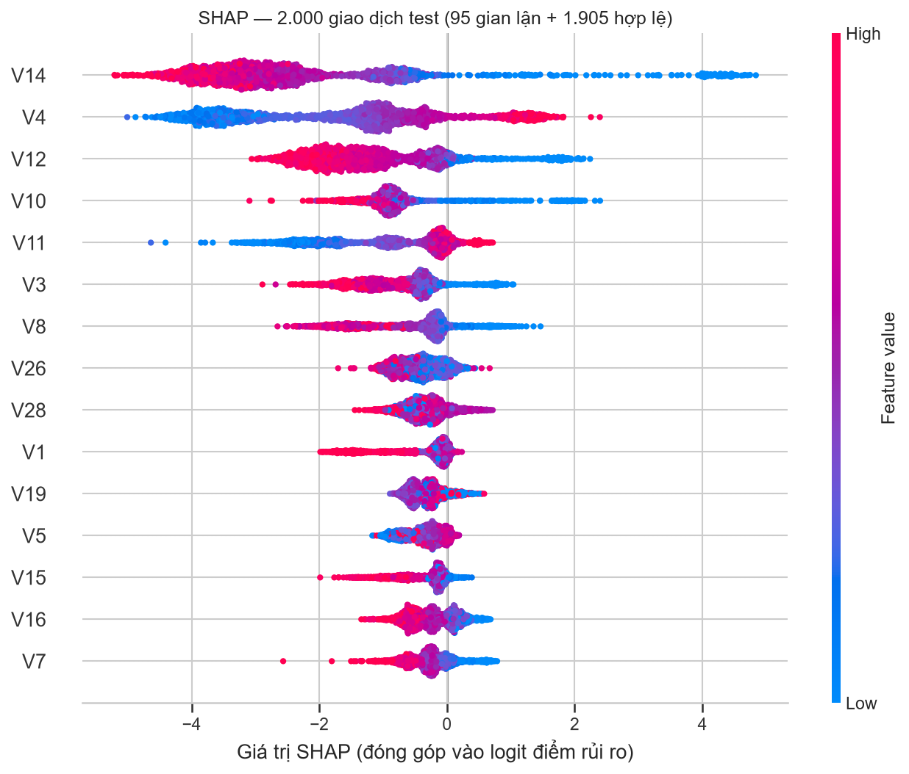

| Hạng SHAP | Đặc trưng | mean\|SHAP\| | Tỷ trọng | Hạng theo Cohen's d | Hạng theo Cliff's δ |
|---|---|---|---|---|---|
| 1 | V14 | 2,68 | 15,8% | 2 | 1 |
| 2 | V4 | 1,88 | 11,1% | 9 | 2 |
| 3 | V12 | 1,29 | 7,6% | 3 | 3 |
| 4 | V11 | 1,00 | 5,9% | 8 | 4 |
| 5 | V10 | 0,95 | 5,6% | 4 | 5 |
| 6 | V3 | 0,86 | 5,1% | 6 | 6 |
| 7 | V8 | 0,67 | 3,9% | 17 | 18 |

- **Năm đặc trưng V14, V4, V12, V11, V10 chiếm 46% tổng mean|SHAP|.** Giờ trong ngày (`hour_sin` +
  `hour_cos`) chiếm 2,7%, `Amount` 2,0%.
- **SHAP và thống kê đơn biến chỉ đồng thuận vừa phải:** tương quan hạng Spearman với Cohen's d 0,42,
  với Cliff's δ 0,43, với hệ số Logistic Regression 0,30.
- **V17 — hạng 1 theo Cohen's d — chỉ hạng 24/31 theo SHAP.** Nó tách hai lớp rất tốt khi đứng một mình
  (mục 3), nhưng thừa thông tin khi mô hình đã có V14, V12, V10. Một đặc trưng mạnh đơn biến không nhất
  thiết quan trọng trong mô hình nhiều biến — đây là câu trả lời cho câu hỏi mục 3 để ngỏ.

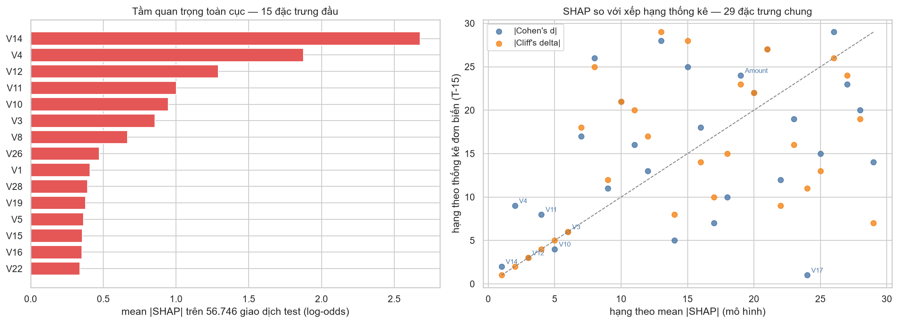

### 9.2 Phân tích lỗi

Tại τ\*, trên tập kiểm thử: 77 TP, 38 FP, 18 FN.

**Bỏ lọt (FN) là giới hạn của đặc trưng, không phải của ngưỡng.** 12/18 vụ bỏ lọt có điểm dưới 0,001 —
mô hình gần như chắc chắn chúng hợp lệ; trung vị điểm của FN là 0,00011. **66,7% vụ bỏ lọt có cả 5 đặc
trưng chính nằm trong khoảng [P1, P99] của lớp hợp lệ**, so với 3,9% ở các vụ bắt được. Trung vị V14:
TP −6,92, FN −0,43, giao dịch hợp lệ 0,06 — vụ bị lọt trông giống hệt giao dịch hợp lệ. Không ngưỡng
hợp lý nào bắt được chúng mà không kéo theo hàng nghìn cảnh báo giả (mục 8.3, dòng recall ≥ 90%).

**Cảnh báo giả (FP) mang chữ ký của gian lận.** FP điểm cao có đủ dấu hiệu V14, V10, V12 đẩy điểm lên
(trung vị V14 của FP là −2,64 — nằm giữa hai lớp); điểm trung vị của FP là 0,065.

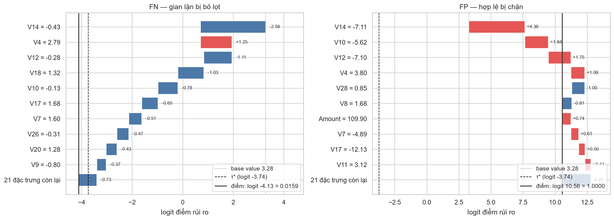

**Giới hạn của mọi diễn giải ở đây:** V1–V28 là thành phần chính sau PCA, ẩn danh hoá. SHAP chỉ nói được
"V14 đẩy điểm rủi ro lên", **không** nói được "vì giao dịch diễn ra ở nước ngoài" hay bất kỳ nguyên nhân
nghiệp vụ nào. Gán ý nghĩa nghiệp vụ cho V1–V28 là sai sự thật.

---

## 10. Ứng dụng demo

Mô hình được đóng gói thành một hệ thống chấm điểm và thẩm định cho hai vai: người phân tích (xem hàng
đợi, quyết định từng giao dịch) và người quản lý rủi ro (chọn ngưỡng, xem hiệu năng).

### 10.1 Kiến trúc

```
Trình duyệt ──► web (nginx, cổng 3000) ──► tệp tĩnh: giao diện Next.js + TypeScript
                         │ /api/…
                         ▼
                 api (FastAPI, cổng 8000) ──► nạp hiện vật lúc khởi động (chỉ đọc):
                         │                    model.joblib, metrics.json, threshold.json,
                         │                    oof_scores.npz, test_set.parquet, sample_pool.json
                         ▼
                 db (PostgreSQL 16): transactions, reviews, settings
```

- **Một lệnh dựng cả hệ thống:** `docker compose up --build`. Thứ tự khởi động: PostgreSQL khỏe → API
  dựng lược đồ (Alembic) và nạp mô hình → giao diện. Khởi động lạnh 13,7–14,9 giây, ấm 11,1–11,5 giây.
- **Không lệch giữa huấn luyện và phục vụ:** API sinh đặc trưng bằng cùng `build_features` với notebook,
  và lúc khởi động chấm lại một phần tập kiểm thử để chắc rằng mô hình cho đúng điểm đã lưu; lệch thì
  từ chối phục vụ.
- **Ngưỡng là cấu hình:** điểm rủi ro lưu vào cơ sở dữ liệu; quyết định và dải rủi ro tính lại từ ngưỡng
  hiện hành mỗi lần trả về. Ngưỡng do người dùng đặt gắn với đúng phiên bản mô hình lúc đặt.
- **Bảo mật ở mức demo:** không có đăng nhập (ngoài phạm vi); vì vậy mọi cổng mặc định chỉ mở trên
  `127.0.0.1`.

### 10.2 Bốn màn hình

**Hàng đợi thẩm định** — giao dịch vượt ngưỡng, sắp theo điểm giảm dần, kèm đề xuất (thẩm định / chặn).
Nạp dữ liệu bằng tải CSV, thư viện mẫu, hoặc phát lại ngày 2.

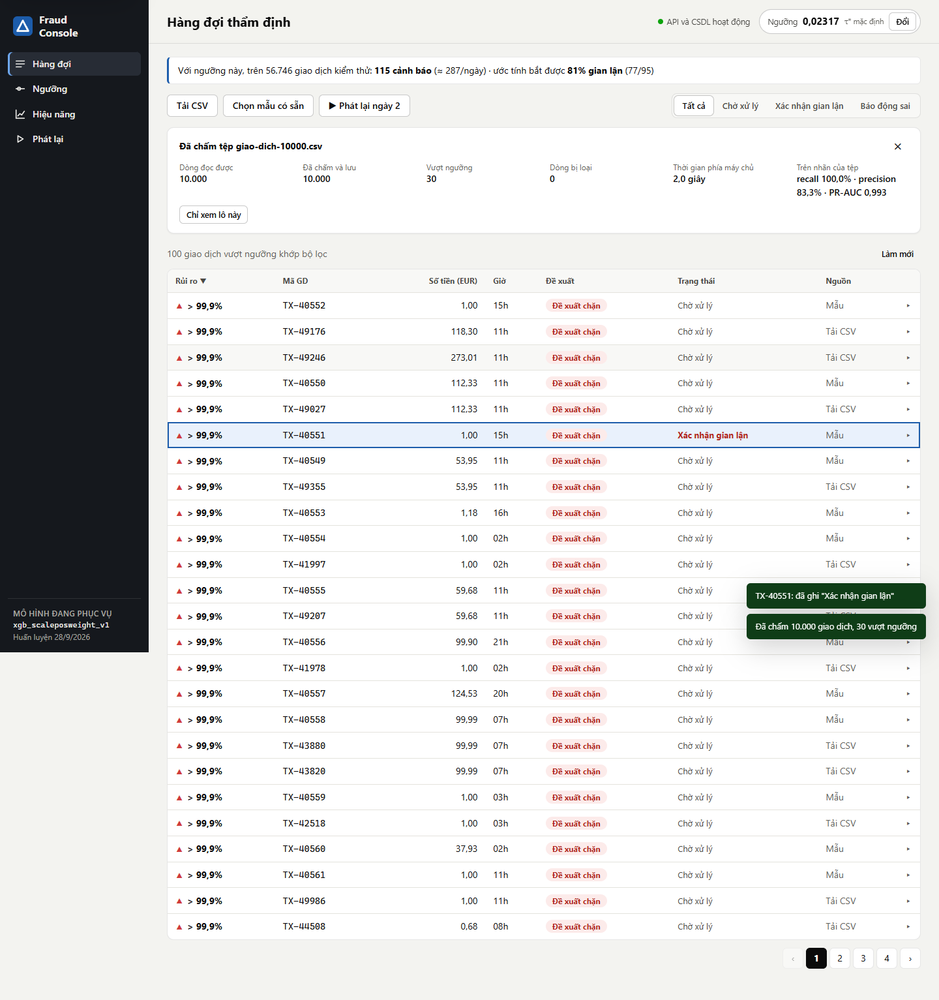

**Chi tiết giao dịch** — điểm, vị trí so với ngưỡng, biểu đồ thác nước SHAP (5 yếu tố đẩy lên, 3 yếu tố
kéo xuống). Nhãn thật chỉ hiện **sau** khi người thẩm định quyết định, để không dẫn dắt; chú thích cố
định nhắc rằng V1–V28 không mang nghĩa nghiệp vụ.

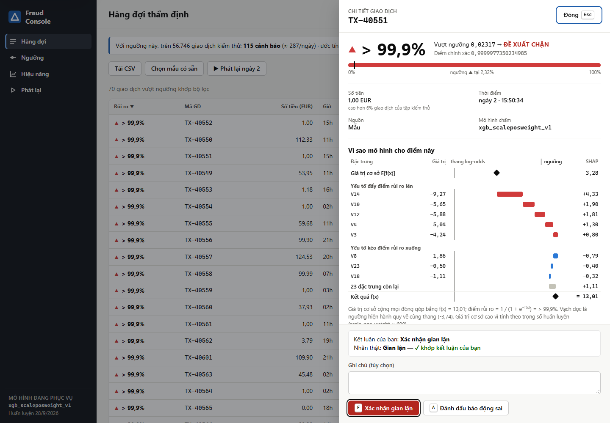

**Cấu hình ngưỡng** — thanh trượt theo thang log; mọi chỉ số (cảnh báo/ngày, gian lận bắt được,
precision, chi phí) tính lại ngay trong trình duyệt. Đổi tham số chi phí thì máy chủ tìm lại ngưỡng tối
ưu trên out-of-fold; có thể thêm ràng buộc vận hành. Hình dưới: chi phí bỏ lọt 600 EUR với ngân sách
150 cảnh báo/ngày — hệ thống báo rằng ràng buộc đang chặn nghiệm.

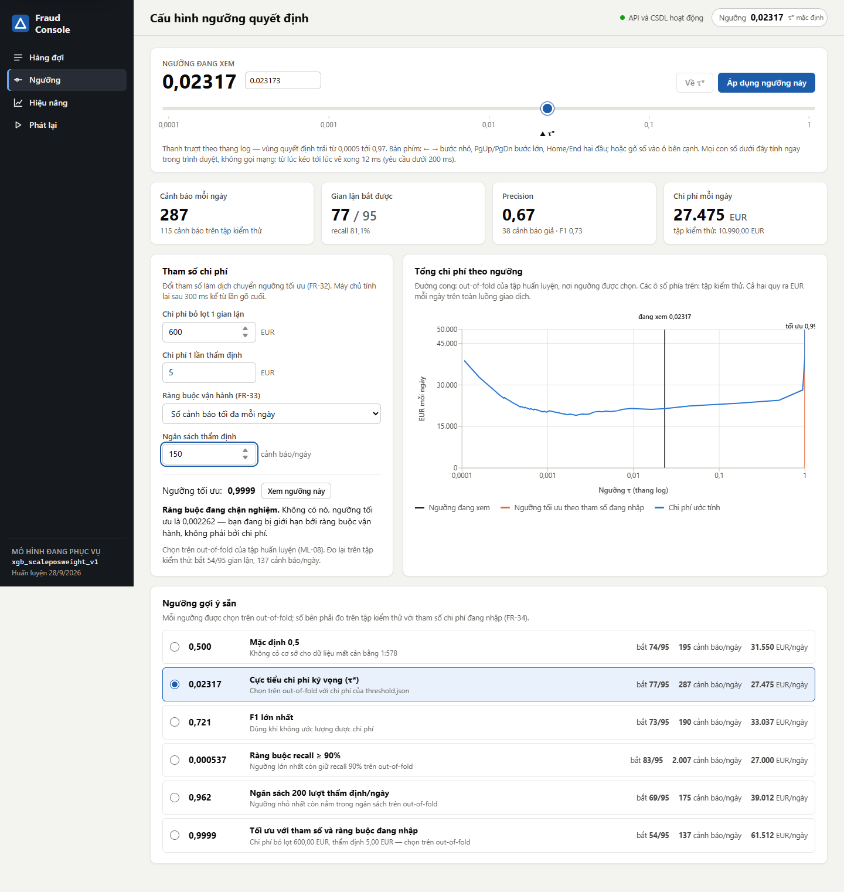

**Hiệu năng mô hình** và **phát lại** — chỉ số kèm khoảng tin cậy, đường PR/ROC, bảng so sánh chiến
lược; chế độ phát lại cho giao dịch ngày 2 "chảy" theo đồng hồ mô phỏng, mô hình chấm từng mẻ khi
giao dịch tới giờ.

### 10.3 Nghiệm thu

| Mã | Tiêu chí | Kết quả |
|---|---|---|
| AC-A1 | Tải CSV 10.000 dòng, chấm xong dưới 30 giây | 2,0 giây phía máy chủ; 3,1 giây tới lúc giao diện hiện kết quả |
| AC-A2 | Hàng đợi sắp đúng theo điểm | Đạt |
| AC-A3 | Kéo thanh trượt cập nhật dưới 200 ms | Lâu nhất 43–131 ms qua 4 lượt |
| AC-A4 | 5 yếu tố dương và 3 yếu tố âm | Đạt **khi mô hình có đủ**: 77% giao dịch điểm thấp có ít hơn 5 đặc trưng đẩy điểm lên; hệ thống không mượn một đóng góp âm để cho đủ 5 |
| AC-A5 | Đổi chi phí làm dịch ngưỡng tối ưu | c_FN 122,21 → 600 EUR: τ tối ưu 0,02317 → 0,00226 |
| AC-A6 | Phát lại 3 phút không lỗi | 185 giây, 1.605 giao dịch, 0 lỗi |
| AC-A7 | Kết luận thẩm định còn sau khởi động lại | Đạt |
| AC-A8 | `docker compose up` trên máy sạch | Đạt trên bản sao sạch của repo — **cùng máy vật lý**, chưa thử trên máy thứ hai |
| AC-A9 | Điều hướng bằng bàn phím | 24/24 bước; Lighthouse Accessibility 100 |
| AC-A10 | Đầu vào sai trả đúng mã lỗi, không sập | 13 loại đầu vào sai, đúng mã HTTP và mã lỗi |

Chấm một giao dịch (`/score`): p95 khoảng 20 ms phía máy chủ (yêu cầu < 50 ms). 350 ca kiểm thử tự động
xanh, gồm kiểm thử chống rò rỉ, đối chiếu phép tính ngưỡng giữa trình duyệt và Python tới từng bit, và
đối chiếu SHAP của API với explainer của notebook tới từng bit.

---

## 11. Hạn chế và hướng mở rộng

### 11.1 Hạn chế của dữ liệu

1. **V1–V28 là thành phần chính sau PCA, không diễn giải được.** Mọi kết luận về đặc trưng (mục 3, 9)
   dừng ở mức "V14 quan trọng"; không suy ra được nguyên nhân nghiệp vụ, không thiết kế được đặc trưng
   mới từ hiểu biết nghiệp vụ, và không kiểm được mô hình có học điều gì vô lý hay không.
2. **Dữ liệu chỉ trải trong hai ngày của tháng 9/2013**, tại châu Âu. Không đại diện cho mùa vụ, cho thị
   trường khác, hay cho các kiểu gian lận xuất hiện sau đó. Ngay giữa hai ngày đã có dịch chuyển: chia
   theo thời gian, precision tại cùng ngưỡng giảm từ 0,67 xuống 0,33 (mục 7.3).
3. **Chỉ 492 mẫu dương (95 trong tập kiểm thử) làm khoảng tin cậy rất rộng.** Khoảng tin cậy 95% của
   PR-AUC rộng 0,15 (0,747–0,896), của recall rộng 0,15. Cận dưới của cả hai sát dưới tiêu chí 0,75;
   nhiều so sánh giữa các cấu hình không kết luận được (mục 5, 6.3, 7.1).
4. **Hai điều bộ dữ liệu không ghi** mà đồ án phải quy ước: đơn vị tiền (EUR) và giờ bắt đầu của `Time`
   (00:00) — mục 1.4.
5. **Nhãn có sẵn tại thời điểm chấm.** Trong thực tế nhãn gian lận chỉ có sau điều tra, có độ trễ; đánh
   giá ở đây không mô phỏng độ trễ đó.

### 11.2 Hạn chế của phương pháp

- **Chi phí là giả định** và quyết định cả dấu của khoản tiết kiệm khi chọn ngưỡng (mục 8.5).
- **Đánh giá chính dùng cách chia ngẫu nhiên**; cách chia theo thời gian sát triển khai hơn và cho kết
  quả thấp hơn.
- **Điểm rủi ro không phải xác suất ở hai đầu** (mục 8.7).
- **Tái lập mới kiểm trên một máy**; huấn luyện lại trên máy khác số lõi có thể lệch nhẹ (mục 7.5).

### 11.3 Hướng mở rộng

- **Chi phí theo số tiền trong hệ thống:** cho phép chọn ngưỡng theo hàm chi phí `Amount` của từng giao
  dịch (đã có trong `src/threshold.py`), hoặc quyết định theo tổn thất kỳ vọng từng giao dịch sau khi
  hiệu chỉnh xác suất.
- **Hiệu chỉnh xác suất** (isotonic trên out-of-fold) để điểm đọc được như xác suất.
- **Theo dõi dịch chuyển và hiệu chỉnh ngưỡng định kỳ**, dùng nhãn thẩm định thu được từ chính hệ thống
  (bảng `reviews`).
- **Đánh giá theo thời gian làm mặc định** khi có dữ liệu dài hơn hai ngày.
- **Đặc trưng hành vi theo thẻ** (tần suất, số tiền so với lịch sử của chính chủ thẻ) — không làm được
  với bộ dữ liệu này vì không có mã thẻ.

---

## 12. Kết luận

1. Ở tỷ lệ 1 : 600, **accuracy vô nghĩa** và ROC-AUC che mất khác biệt; PR-AUC kèm khoảng tin cậy mới
   phân biệt được mô hình. Accuracy thậm chí xếp hạng ngược hai mô hình cơ sở.
2. Trong 20 tổ hợp, **mô hình quyết định nhiều hơn chiến lược xử lý mất cân bằng**. Nhóm dẫn đầu hoà nhau
   ở PR-AUC ≈ 0,855; chọn XGBoost + `scale_pos_weight` vì nhanh và cho điểm mịn. Hiệu quả của SMOTE so
   với trọng số lớp phụ thuộc mô hình; SMOTE + Tomek không thêm gì; undersampling nhanh nhưng kém.
3. Mô hình cuối đạt **PR-AUC 0,825 [0,747; 0,896]** và **recall 0,811 [0,737; 0,884]** trên tập kiểm thử,
   đạt tiêu chí theo ước lượng điểm; khi chia theo thời gian, PR-AUC còn 0,782 và precision giảm một nửa.
4. **Chọn ngưỡng theo chi phí là trọng tâm của bài toán, và kết luận phụ thuộc giả định chi phí.** Dưới
   chi phí cố định, τ\* = 0,0232 vững trong một dải tỷ lệ rộng; tính theo số tiền, lợi thế của nó so với
   0,5 biến mất. Điều vững là đáy chi phí phẳng, nên chọn trong đáy đó theo năng lực thẩm định.
5. Vụ bỏ lọt là **giới hạn của đặc trưng**: hai phần ba trông giống hệt giao dịch hợp lệ trên cả 5 đặc
   trưng quan trọng nhất. Học có giám sát thắng rõ autoencoder (0,825 so với 0,329).
6. Ngưỡng được tách khỏi mô hình thành cấu hình của một hệ thống chạy được, nơi người dùng thấy ngay cái
   giá của mỗi lựa chọn ngưỡng.

---

## Tài liệu tham khảo

1. A. Dal Pozzolo, O. Caelen, R. A. Johnson, G. Bontempi. *Calibrating Probability with Undersampling for
   Unbalanced Classification.* IEEE Symposium on Computational Intelligence and Data Mining (CIDM), 2015.
   Dữ liệu: Machine Learning Group — ULB, *Credit Card Fraud Detection*, Kaggle,
   <https://www.kaggle.com/datasets/mlg-ulb/creditcardfraud>, giấy phép Database Contents License (DbCL) v1.0.
2. T. Saito, M. Rehmsmeier. *The Precision-Recall Plot Is More Informative than the ROC Plot When
   Evaluating Binary Classifiers on Imbalanced Datasets.* PLoS ONE 10(3), 2015.
3. N. V. Chawla, K. W. Bowyer, L. O. Hall, W. P. Kegelmeyer. *SMOTE: Synthetic Minority Over-sampling
   Technique.* Journal of Artificial Intelligence Research 16, 2002.
4. I. Tomek. *Two Modifications of CNN.* IEEE Transactions on Systems, Man, and Cybernetics 6(11), 1976.
5. T. Chen, C. Guestrin. *XGBoost: A Scalable Tree Boosting System.* KDD 2016.
6. G. Lemaître, F. Nogueira, C. K. Aridas. *Imbalanced-learn: A Python Toolbox to Tackle the Curse of
   Imbalanced Datasets in Machine Learning.* Journal of Machine Learning Research 18, 2017.
7. H. B. Mann, D. R. Whitney. *On a Test of Whether One of Two Random Variables Is Stochastically Larger
   than the Other.* Annals of Mathematical Statistics 18(1), 1947.
8. Y. Benjamini, Y. Hochberg. *Controlling the False Discovery Rate: A Practical and Powerful Approach to
   Multiple Testing.* Journal of the Royal Statistical Society B 57(1), 1995.
9. N. Cliff. *Dominance Statistics: Ordinal Analyses to Answer Ordinal Questions.* Psychological
   Bulletin 114(3), 1993.
10. B. Efron, R. J. Tibshirani. *An Introduction to the Bootstrap.* Chapman & Hall, 1993.
11. C. Elkan. *The Foundations of Cost-Sensitive Learning.* IJCAI 2001.
12. E. B. Wilson. *Probable Inference, the Law of Succession, and Statistical Inference.* Journal of the
    American Statistical Association 22, 1927.
13. B. Zadrozny, C. Elkan. *Transforming Classifier Scores into Accurate Multiclass Probability
    Estimates.* KDD 2002.
14. S. M. Lundberg, S.-I. Lee. *A Unified Approach to Interpreting Model Predictions.* NeurIPS 2017.
15. S. M. Lundberg và cộng sự. *From Local Explanations to Global Understanding with Explainable AI for
    Trees.* Nature Machine Intelligence 2, 2020.
16. F. Pedregosa và cộng sự. *Scikit-learn: Machine Learning in Python.* Journal of Machine Learning
    Research 12, 2011.

---

## Phụ lục

### A. Đối chiếu tiêu chí nghiệm thu phần mô hình và tài liệu

| Mã | Tiêu chí | Kết quả | Ở đâu |
|---|---|---|---|
| AC-M1 | PR-AUC test ≥ 0,75 | 0,825 [0,747; 0,896] — đạt theo ước lượng điểm | 7.2 |
| AC-M2 | Recall ≥ 0,75 tại ngưỡng đề xuất | 0,811 [0,737; 0,884] — đạt theo ước lượng điểm | 7.2 |
| AC-M3 | Đủ 20 tổ hợp | 20/20 | 6.2 |
| AC-M4 | Không rò rỉ | 7/7 điểm kiểm, thành kiểm thử tự động | 4.3 |
| AC-M5 | Tái lập, PR-AUC lệch < 0,001 | Lệch 0 | 7.5 |
| AC-M6 | Khoảng tin cậy cho chỉ số chính | Mọi chỉ số chính | 7.2, 8.3 |
| AC-M7 | Hai cách chia tập | Ba cách chia, có nhóm đối chứng | 7.3 |
| AC-M8 | Độ nhạy theo tỷ lệ chi phí | 5 : 1 → 100 : 1 | 8.4 |
| AC-D1 | Trả lời "vì sao chọn ngưỡng này" bằng lập luận chi phí | Có, kèm giới hạn | 8.8 |
| AC-D2 | Nêu hạn chế: PCA, hai ngày, 492 mẫu dương | Có | 11.1 |
| AC-D3 | README chạy lại từ đầu | `README.md`, mục "Chạy lại từ đầu trên máy sạch" | — |
| AC-D4 | Biểu đồ có tiêu đề, nhãn trục, đơn vị | Có | Mọi hình |
| AC-D5 | Nguồn dữ liệu và giấy phép DbCL v1.0 | Có | 1.2, tài liệu tham khảo [1] |

### B. Tái lập kết quả

| Bước | Lệnh hoặc notebook | Sinh ra |
|---|---|---|
| Tải dữ liệu | `python scripts/download_data.py --mirror` | `data/creditcard.csv`, tự kiểm toàn vẹn |
| EDA, thống kê | `notebooks/01_eda`, `02_statistics` | `reports/figures/01_*`, `02_*`, `feature_ranking.csv` |
| Mô hình cơ sở | `notebooks/03_baseline` | `data/test_set.parquet`, `baseline_results.csv` |
| Lưới 20 tổ hợp | `python scripts/run_grid.py`, rồi `notebooks/04_imbalance_strategies` | `grid_results.csv` (≈ 46 phút) |
| Tinh chỉnh, tập kiểm thử | `python scripts/run_search.py`, rồi `notebooks/05_advanced_models` | `search_results.csv`, `final_test_metrics.csv`, `split_comparison.csv` |
| Ngưỡng, chi phí | `notebooks/06_threshold_and_cost` | `threshold_comparison.csv`, `cost_sensitivity.csv`, `amount_cost_*.csv`, `block_threshold.csv`, `calibration.csv` |
| Autoencoder, SHAP | `notebooks/06b_autoencoder`, `07_explainability` | `autoencoder_comparison.csv`, `shap_ranking.csv`, `error_analysis.csv` |
| Hiện vật cho API | `notebooks/08_export_artifacts` | `models/*`, `data/sample_pool.json` |
| Kiểm tra tái lập | `python scripts/check_reproducibility.py` | `reproducibility.csv` (≈ 71 phút) |
| Hệ thống | `docker compose up --build` | http://localhost:3000 |

Môi trường: Python 3.12; phiên bản thư viện ghim trong `requirements.txt` trùng với lúc xuất hiện vật
(numpy 2.5.3, pandas 3.0.5, scikit-learn 1.9.1, imbalanced-learn 0.14.2, xgboost 3.4.1, shap 0.52.0).

### C. Ánh xạ với chương trình học

| Chương | Vận dụng trong đồ án |
|---|---|
| Ch.1 | Quy trình khoa học dữ liệu từ dữ liệu thô tới hệ thống chạy được |
| Ch.2 — PCA | Đọc hiểu V1–V28 là thành phần chính; không chạy PCA lần nữa (mục 2, 3) |
| Ch.3 — EDA | Phân bố `Amount`/`Time`, tương quan, t-SNE (mục 2) |
| Ch.4 — Xác suất, thống kê | Mất cân bằng cực đoan, Precision/Recall/PR-AUC, kiểm định Mann–Whitney, BH, bootstrap (mục 3, 4) |
| Ch.5 — Mô hình tuyến tính, cây | Logistic Regression, Decision Tree (mục 5) |
| Ch.6 — Ensemble, mất cân bằng | Random Forest, XGBoost, SMOTE, trọng số lớp, chọn ngưỡng, học theo chi phí (mục 6, 8) |
| Ch.8 — Học sâu (tùy chọn) | Autoencoder phát hiện bất thường (mục 7.4) |
